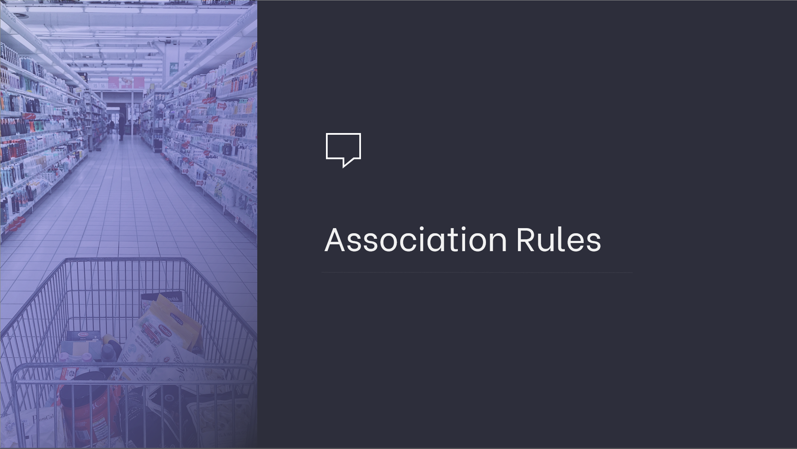
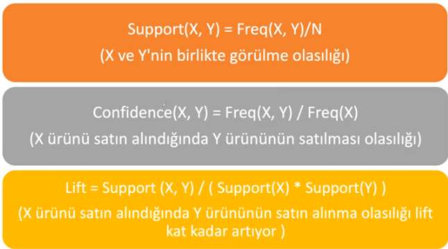
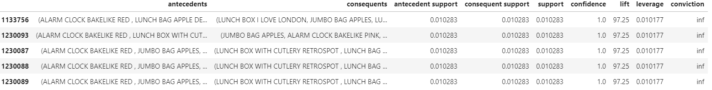

# Association Rule Learning



Veri içerisindeki pattern'leri (ilişkileri, yapıları) bulmak için kullanılan kural tabanlı bir makine öğrenmesi tekniğidir.

**Wallmart yaptığı analizlerde görüyor ki bebek bezi ile bira satışları arasında bir ilişki var.**

Burada iki aksiyon fikri olabilir.

- İki ürünü farklı yerlere koymak. (ara raflardaki ürünler ile satış artırma hedefi)
- Lift istatistiğine göre ürünleri yan yana koymak. (ikili satışı artırmak)

Özetle birliktelik kuralları; veri seti içerisindeki basit istatistiksel örüntüleri, frekansları ortaya çıkarır.

Bu frekansları elde etmek mağaza raflarında çeşitli aksiyonlar alma fikirleri verebilir.

Aynı zamanda bize tavsiye sistemleri olarak da bunları kullanma imkanı verir.

**Ne işe yarar?**

- Pazarlama çalışmalarına katkı sağlar.
- Marketlerin reyonlarının dizilimine katkı sağlar.
- E-ticaret kategorilerinin dizaynlarına destek olur.
- Çarpraz satışa destek olur. (Mouse alana Klavye önermek)
- Ürün indirimine yardımcı olur.
- Tavsiye sistemine yardımcı olur.

Bu repoda en kullanılanı Aprior algoritması ele alınmıştır

---

# **Apriori Algorithm**

Kullanıcı alışverişlerinden ürün birlikteliklerini ortaya çıkarmak için kullanılan bir yöntemdir.

Belirlenecek bir **eşik değere göre** satın alınan ürünlerin birlikteliklerini görme imkanı sağlar.



**Support:** X ve Y nin birlikte görülme olasılığı.

**Confidence:** X ürünü satın alındığında Y ürününün satılması olasılığı.

**Lift:** X ürünü satın alındığında Y ürününün satın alınma olasılığı lift kat kadar artıyor.

Lift aslında bir bağımsızlık ölçüsü.

Buradaki X ve Y nin bağımsızlığını veren bir ölçü.

**Lift > 1 ise bunlar birbirlerine bağlı ve birbirlerini etkiliyor yorumu yapılır.**

Örn: Süt alındığında peynir alınma olasığı **lift** kat kadar artar.

Örnek final tablosu:



## Dataset Information

Used Online Retail 2 dataset in this project.

This dataset contains the purchase values of a wholesale company's customers in UK between 2010-2011.

## Features

**InvoiceNo**: Unique invoice number. C means refundees.

**StockCode**: Unique item code

**Description**: Item description

**Quantity**: Item quantity number

**InvoiceDate**: Invoice date time

**UnitPrice**: Item price (Sterlin)

**CustomerID**: Unique Customer Number

**Country**: Country name. The country where the customer lives.

### Libraries

```
datetime
pandas
pymysql
sqlalchemy 
sklearn
lifetimes
```

------

### Author

**Oğuz Han Erdoğan** - [oguzerdo](https://github.com/oguzerdo)

------

### Reference:

```
VBO - Data Science and Machine Learning Bootcamp
www.veribilimiokulu.com
```