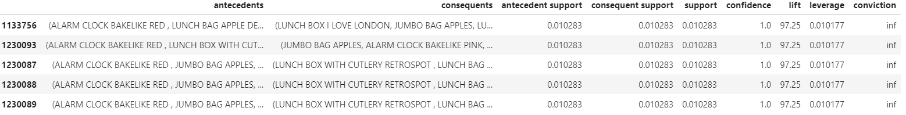

# Association Rule Learning

It is a rule-based machine learning technique used to find patterns (relationships, structures) in data.

**In Wallmart’s analysis that there is a relationship between diaper and beer sales.**

There may be two action ideas here.

- Putting the two products in different places. (sales increase target with products on intermediate shelves) 
- Putting products side by side according to lift statistics. (increase bilateral sales)

Association rules in a nutshell; reveal simple statistical patterns, frequencies within the data set.

Achieving these frequencies can give ideas for various actions on store shelves.

It also allows us to use them as recommending systems.

**What does it do ?**

Contributes to marketing studies.

Contributes to the arrangement of the shelves of the markets.

Supports the design of e-commerce categories.

Cross supports sales. (Suggest a keyboard to the mouse area)

Helps with product discount.

Helps the recommendation system. 

The most commonly used **Apriori algorithm** is used in this repo. 

---

# **Apriori Algorithm**

**Support:** The probability of X and Y occurring together

**Confidence:** The probability that product Y will be sold when product X is purchased.

**Lift:** When the product X is purchased, the probability of purchasing Y product increases as much as the lift floor.

Lift is actually a measure of independence.

Here is a measure that gives the independence of X and Y.

**If Lift> 1, it is commented that they are connected to each other and affect each other. **

**For example:** When milk is taken, the probability of getting cheese increases by **lift** times.

Sample final table: 



---

## Dataset Information

Used Online Retail 2 dataset in this project.

This dataset contains the purchase values of a wholesale company's customers in UK between 2010-2011.

---

## Features

**InvoiceNo**: Unique invoice number. C means refundees.

**StockCode**: Unique item code

**Description**: Item description

**Quantity**: Item quantity number

**InvoiceDate**: Invoice date time

**UnitPrice**: Item price (Sterlin)

**CustomerID**: Unique Customer Number

**Country**: Country name. The country where the customer lives.

---

### Libraries

```
datetime
pandas
pymysql
sqlalchemy 
sklearn
lifetimes
```

------

### Author

**Oğuz Han Erdoğan** - [oguzerdo](https://github.com/oguzerdo)

------

### Reference:

```
VBO - Data Science and Machine Learning Bootcamp
www.veribilimiokulu.com
```